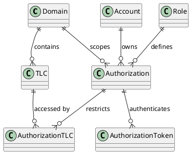

# Security Framework

The Subject Interface implements a multi-layer security framework covering authorization, authentication, and transport security.

## Authorization Framework

The authorization framework governs system access through an entity-relationship model supporting secure multi-tenant operations across domains and jurisdictions.

### Core Authorization Entities

| Entity | Purpose | Key Characteristics |
|--------|---------|-------------------|
| **Account** | Identity holder (individual/organization) | Owns multiple TLC registrations and authorizations; primary entity for permission assignment |
| **Authorization** | API permission definition | Combines Account + Domain + Role; establishes security context for all operations |
| **Role** | Functional capabilities | TLC (ownership), BROKER (distribution), MONITOR (observation); determines available endpoints |
| **Domain** | Operational scope/jurisdiction | Geographic/organizational/project boundaries; complete data isolation |
| **TLC** | Subject registration | 8-character identifier within domain; cornerstone for data routing and access control |

### Authorization Entity Relationships

The framework implements a carefully designed entity-relationship model:

### Key Relationships

| Relationship | Cardinality | Purpose |
|-------------|------------|---------|
| Domain ↔ TLC | 1:∞ | Domain isolation, jurisdictional data separation |
| Account ↔ Authorization | 1:∞ | Multi-domain operations, role separation |
| Role ↔ Authorization | 1:∞ | Functional capability assignment |
| Authorization ↔ Token | 1:∞ | Multiple active tokens, token rotation |
| Authorization ↔ TLC | ∞:∞ | Fine-grained access control (via AuthorizationTLC) |

### Authorization Scope Levels

| Scope | Access Level | Applicable Roles | Use Cases |
|-------|-------------|------------------|-----------|
| **AuthorizationTLC** | Specific subjects within domain | TLC_SYSTEM, TLC_ANALYST | Device-specific access, regional restrictions, maintenance windows |
| **Domain-Level** | All resources in domain | Domain admins, monitors, brokers | Full domain access, subject discovery, bulk operations |

## Token-Based Authentication

The Subject Interface uses a token-based authentication system for secure API access with operational flexibility and token lifecycle management.

### Authorization Token Architecture

| Aspect | Details |
|--------|----------|
| **Token Generation** | Generated for specific authorizations; multiple active tokens per authorization; cryptographically secure identifiers |
| **Lifecycle** | No expiration mechanism - remain valid until explicitly revoked |
| **Operational Benefits** | Multiple tokens prevent service disruption; security isolation; flexible deployment; audit granularity |

### Token Structure

| Component | Details |
|-----------|----------|
| **Format** | Base64url-encoded strings; cryptographically random; URL-safe |
| **Example** | `dtNB_vhvJ0wgTGf1N0DxN38_AmTL_4yiPRZdqZSuK3k` |
| **Metadata** | Unique UUID; linked to authorization |

### Authentication Implementation

#### HTTP Header Authentication

| Specification | Details |
|---------------|----------|
| **Header Name** | `X-Authorization` (case-insensitive) |
| **Header Value** | Token string only, no prefixes (case-sensitive) |
| **Usage** | Required for all authenticated endpoints |
| **Example** | `X-Authorization: dtNB_vhvJ0wgTGf1N0DxN38_AmTL_4yiPRZdqZSuK3k` |

### Token Lifecycle Management

#### Token Rotation

| Step | Process |
|------|----------|
| **1. Create** | Create new token while old token remains active |
| **2. Deploy** | Deploy new token to systems |
| **3. Verify** | Verify new token functionality |
| **4. Revoke** | Revoke old token |
| **5. Complete** | Zero-downtime rotation completed |

#### Token Revocation

| Aspect | Details |
|--------|----------|
| **Method** | DELETE request to `/authorizationtokens/{uuid}` |
| **Effect** | Instant invalidation; cannot be reversed; audit log entry created |

| Scenario | Use Case |
|----------|----------|
| **Security Incident** | Immediate revocation of compromised tokens |
| **Employee Departure** | Revoke associated tokens |
| **System Decommission** | Clean up unused tokens |
| **Regular Rotation** | Part of security maintenance |

### Multi-Token Strategies

Multiple tokens for the same authorization serve one primary purpose: token rotation. This allows creating a new token while the old token remains active, enabling zero-downtime rotation procedures.

For system isolation and access control, use separate authorizations rather than multiple tokens. Each system or device should operate with its own authorization, even when roles and scope are identical.

### Authorization Separation

| Separation Type | Recommendation | Benefits |
|----------------|----------------|----------|
| **System-Based** | One authorization per system/device | Independent access control; isolated audit trails; simplified troubleshooting |
| **Environment-Based** | Separate authorizations for dev/staging/production | Environment isolation; different access scopes; independent lifecycle management |
| **Functional-Based** | Separate authorizations per service function | Service-specific permissions; granular access control; compliance boundaries |

### Security Best Practices

| Category | Best Practices |
|----------|----------------|
| **Storage** | Never store in source code; use secure credential management; encrypt at rest; limit access |
| **Transmission** | Always use HTTPS; never include in URLs; avoid logging values; secure configuration management |
| **Access Control** | Least-privilege principles; specific tokens for specific purposes; regular reviews; monitor usage |
| **Token Inventory** | Maintain registry; document purposes; track assignments; regular audits |
| **Incident Response** | Rapid revocation procedures; usage investigation; audit trail analysis; security protocols |
| **Monitoring** | Track failures; monitor unusual patterns; alert on suspicious activity; regular reviews |

## TCP Streaming Security

The Subject Interface implements optional Transport Layer Security (TLS) for the TCP streaming protocol layer.

> **Note:** TLS configuration for the JSON-REST API layer is handled at the deployment level through standard web infrastructure components and is not covered in this specification.

### TLS Implementation Specifications

| Specification | Details |
|---------------|----------|
| **TLS Version** | TLS v1.2 exclusively; no older SSL/TLS versions; TLS v1.3 not currently supported |
| **Security Rationale** | Eliminates vulnerabilities; wide compatibility; balance between security and compatibility |

### Supported Cipher Suite

Single cipher suite: **`TLS_ECDHE_RSA_WITH_AES_128_GCM_SHA256`**

| Component | Details |
|-----------|----------|
| **Key Exchange** | ECDHE - Perfect forward secrecy; key generation |
| **Authentication** | RSA - Widely supported standard |
| **Encryption** | AES-128-GCM - Authenticated encryption; hardware acceleration support |
| **Hash** | SHA-256 - Message authentication; integrity verification |

### Authentication Model

| Aspect | Details |
|--------|----------|
| **TLS Handshake** | Standard handshake establishes encrypted channel; no client certificates required |
| **Session Authentication** | Handled via tokens after TLS establishment |
| **Server Certificate** | Valid period; proper key usage for server authentication |

### Security Mode Configuration

Security modes are configured during session creation via the REST API. The streaming protocol layer implements the security mode specified in the session configuration.

## See Also

- [Create Session](../api-endpoints/reference/endpoints-reference.md#create-session) - POST /sessions endpoint for configuring security modes
- [Communication Modes](../tcp-streaming-protocol/communication-modes.md#security-mode-configuration) - Detailed security mode options and use cases