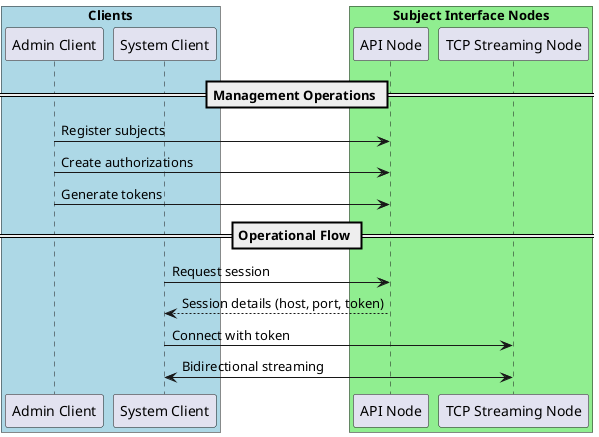

# Dual-Layer Architecture

The Subject Interface uses a dual-layer architecture that separates management operations from data streaming through specialized nodes.

## Overview

The two components work together to provide a complete C-ITS communication solution:

## API Node

The API Node implements the JSON-REST interface, providing lifecycle management and administrative control through web service endpoints.

### Core Characteristics

| Characteristic | Description |
|---------------|-------------|
| Protocol | JSON-REST principles |
| Access Control | Role-based permissions |
| Management | Resource lifecycle operations |
| Multi-tenancy | Cross-domain and jurisdiction support |

### Responsibilities and Functions

| Function | Purpose | Operations |
|----------|---------|------------|
| **Session Lifecycle** | Manage streaming sessions | Session creation with protocol selection, real-time monitoring, dynamic updates, graceful termination |
| **Resource Management** | Handle CRUD operations | Subject registrations, authorizations, tokens, accounts |
| **Authentication & Authorization** | Secure access control | Token validation, role-based access, scope restrictions, token relationships |
| **Administrative Monitoring** | System visibility and logs | Historical session data, connection logs, system health status, diagnostic information |
| **Configuration Management** | System parameters | Domain configuration, operational parameters, security settings, system limits |

### Interface Categories

| Category | Purpose | Capabilities |
|----------|---------|-------------|
| **ADMIN Interfaces** | Administrative control | TLC registrations, authorization management, token generation/revocation, system configuration |
| **SYSTEM Interfaces** | Operational functionality | Session creation/management, streaming control, real-time data exchange, connection monitoring |
| **Cross-Role Functionality** | Shared capabilities | Dynamic subject discovery, load balancing, service distribution, domain-wide queries |

### Access Control Implementation

| Component | Implementation | Details |
|-----------|----------------|----------|
| **Role-Based Validation** | Permission enforcement | Verify roles, enforce boundaries, validate contexts, apply restrictions |
| **Scope Enforcement** | Multi-level access | Platform (full system), Domain (domain-wide), Account (owned resources), Authorization (specific TLCs) |
| **Token Management** | Credential control | Multiple active tokens, rotation without disruption, usage tracking, immediate revocation |

## TCP Streaming Node

The TCP Streaming Node implements the TCP streaming protocol, managing data exchange connections and providing low latency, high-volume communication.

### Core Characteristics

| Characteristic | Description |
|---------------|-------------|
| Implementation | Native TCP streaming with binary protocol |
| Data Exchange | Continuous asynchronous bidirectional streaming |
| Payload Design | Message-agnostic, supports any payload type |
| Monitoring | Built-in time synchronization and health tracking |

### Architecture and Performance Features

| Feature | Description |
|---------|------------|
| **Resilience** | Automatic recovery, fault tolerance, connection state persistence |
| **Horizontal Scalability** | Load balancing, stateless nodes, dynamic capacity adjustment |
| **Low Latency** | Real-time communication, minimal protocol overhead, direct TCP sockets |
| **High Throughput** | High-frequency messages, concurrent streams, backpressure handling |
| **Resource Optimization** | Memory utilization, bandwidth management, CPU optimization, connection pooling |

### Protocol and Operational Features

| Feature | Implementation |
|---------|---------------|
| **Version Management** | Protocol negotiation at connect, future compatibility, graceful mismatch handling |
| **Frame-Based Communication** | Structured datagrams with integrity checking, fixed headers, variable payloads |
| **Time Synchronization** | Clock difference detection, regular timestamp exchanges, drift termination |
| **Security Integration** | Optional TLS v1.2, per-session configuration, token-based authentication |

### Core Responsibilities

| Function | Purpose | Operations |
|----------|---------|------------|
| **Connection Management** | TCP connection handling | Establishment procedures, keep-alive mechanisms, health monitoring, graceful termination |
| **Data Routing** | Payload distribution | TLC to Broker routing, Broker to TLC distribution, Monitor replication, scope-based filtering |
| **Time Synchronization** | Timing enforcement | Timestamp exchanges, clock difference calculations, drift detection, automatic enforcement |
| **Security Enforcement** | Policy application | Token validation, session authentication, TLS encryption, access control verification |
| **Quality Monitoring** | Performance tracking | Latency measurements, throughput statistics, error rate tracking, performance indicators |
| **Load Management** | Resource distribution | Connection algorithms, utilization monitoring, automatic redistribution, capacity thresholds |

