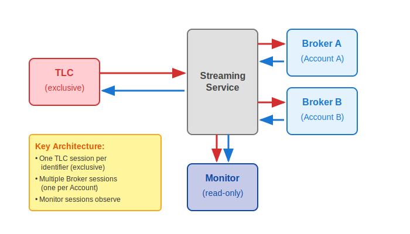

# Communication Modes

The TCP Streaming Protocol supports communication modes for different C-ITS participant roles and operational requirements. This section covers protocol variants and session type characteristics.

## Singleplex vs Multiplex

The TCP Streaming Protocol provides two fundamental variants that determine how TLC identifiers are handled within sessions.

| Aspect | Singleplex (TCPStreaming_Singleplex) | Multiplex (TCPStreaming_Multiplex) |
|--------|-------------------------------------|-------------------------------------|
| **Characteristics** | Single TLC identifier per session; implicit identifier; optimized format; lower overhead | Multiple TLC identifiers per session; explicit identifier in payload; tagged format; efficient multi-entity |
| **Payload Datagram** | [Payload without TLC Identifier (0x04)](datagram-types.md#payload-without-tlc-identifier-0x04) | [Payload with TLC Identifier (0x05)](datagram-types.md#payload-with-tlc-identifier-0x05) |
| **Use Cases** | Individual TLCs; single sensors; point-to-point; resource-constrained devices | Central management; broker operations; multi-device monitoring; aggregation points |
| **Benefits** | Reduced overhead (8 bytes saved); simpler implementation; lower bandwidth; exclusive access | Single connection for multiple entities; reduced connection overhead; simplified management; dynamic TLC handling |
| **Validation** | N/A (implicit identifier) | Must match session scope; invalid IDs dropped; no error response; logged for diagnostics |

## Session Types

The Subject Interface defines three session types, each tailored for specific roles within the C-ITS ecosystem.

### Data Flow Architecture

| Aspect               | TLC (subject) Sessions                                 | Broker Sessions                                     | Monitor Sessions                             |
| -------------------- | ------------------------------------------------------ | --------------------------------------------------- | -------------------------------------------- |
| **Role**             | Data owner for specific identifier                     | Data hub for multiple identifiers                   | System observer for analytics                |
| **Concurrency**      | One active session per identifier (exclusive)          | Multiple sessions allowed (one per Account)         | Multiple sessions allowed (one per Account)  |
| **Data Flow**        | Send to all Brokers in scope; receive from all Brokers | Fan-in from TLC (subject); fan-out to TLC (subject) | Receive-only from TLC (subject) and Brokers  |
| **Protocol Support** | Singleplex or Multiplex                                | Multiplex only                                      | Multiplex only                               |
| **Typical Use Case** | Road side systems / devices, Central data publishers   | Service Providers, Central C-ITS systems            | Analytics dashboard or compliance monitoring |

## Security Modes

Security mode is configured when requesting a streaming session through the [`POST /sessions`](../api-endpoints/reference/endpoints-reference.md#create-session) endpoint. The mode is specified in the session request payload and determines whether the resulting TCP connection uses TLS (Transport Layer Security).

| Aspect | NONE | TLSv1.2 |
|--------|------|---------|
| **Description** | Plain TCP communication without encryption | Encrypted communication using TLS v1.2 |
| **Use Cases** | Development environments; isolated networks; performance-critical applications | Production deployments; public networks; sensitive data transmission; compliance requirements |