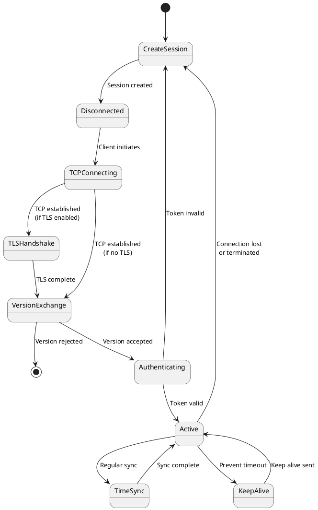

# Connection Management

Connection management within the TCP Streaming Protocol covers the lifecycle of streaming sessions, from initial establishment through active monitoring to graceful termination. This section details the procedures, requirements, and best practices for managing TCP streaming connections.

## Connection Establishment Process

### Prerequisites

| Requirement | Details |
|-------------|----------|
| **Session Creation** | Valid session via JSON-REST API; session type/protocol specified; token generated |
| **Service Assignment** | Streaming Node assigned; connection details provided; network route verified |
| **Authentication** | Valid session token; corresponds to active session; proper permissions |
| **Network Connectivity** | TCP/IP connectivity; sufficient bandwidth; low-latency path preferred |

### Establishment Sequence

The connection establishment follows a structured four-phase process:

| Phase | Steps | Details |
|-------|-------|----------|
| **0. Session Creation** | API request; service assignment; token generation | Create session via JSON-REST API; specify type/protocol; receive connection details and token |
| **1. TCP Connection** | Connection initiation; TLS handshake (if enabled); validation | Standard TCP handshake; optional TLS with `TLS_ECDHE_RSA_WITH_AES_128_GCM_SHA256`; verify establishment |
| **2. Protocol Negotiation** | Version exchange; validation; confirmation | Client sends version `0x01`; service validates; connection closed if unsupported |
| **3. Authentication** | Token transmission; validation; result | Client sends Token datagram; service validates against database; failure = immediate termination |
| **4. Operational Readiness** | Active state; time sync; keep-alive | Enable bidirectional exchange; connection health monitoring |

### Error Handling During Establishment

| Error Type | Common Issues |
|------------|---------------|
| **Network** | TCP timeout/retry; connection refused; network unreachable; DNS resolution failures |
| **TLS** | Handshake failures; cipher negotiation; timeout; trust chain validation |
| **Protocol** | Unsupported version; invalid format; version timeout; no response |
| **Authentication** | Invalid/expired tokens; session not found; insufficient permissions |

## Active Connection Monitoring

### Time Synchronization Monitoring

| Aspect | Details |
|--------|----------|
| **Process** | Regular timestamp requests (configurable interval); mandatory client response; four-timestamp calculation; 1-minute average trending |
| **Threshold** | Automatic termination if average exceeds deployment threshold; no warnings; immediate closure. See [Clock Sync Enforcement](protocol-enforcement.md#clock-synchronization-enforcement) |
| **Requirements** | NTP stratum 1/GPS synchronized clocks; consistent time source; ±1ms accuracy |
| **Metrics** | Roundtrip time; clock stability; response reliability; network jitter; connection quality |

## Connection Lifecycle Management

### Session State Management

Streaming connections progress through well-defined states during their operational lifecycle.

#### Connection States

| State | Description |
|-------|-------------|
| **Establishing** | TCP connection and protocol negotiation; version exchange; handshake procedures |
| **Authenticating** | Token validation; authorization verification; permission validation |
| **Active** | Full operational state; payload streaming enabled; time sync monitoring active |
| **Monitored Violation** | Enforcement thresholds exceeded; automatic termination; see [Protocol Enforcement](protocol-enforcement.md) |
| **Terminating** | Graceful shutdown; final data transmission; resource cleanup |
| **Terminated** | Connection closed; resources released; session marked complete |

#### State Transitions

**Normal Flow:**
`Establishing → Authenticating → Active → Terminating → Terminated`

**Error Conditions:**
`Any State → Terminating → Terminated`

**Enforcement Violations:**
`Active → Monitored Violation → Terminating → Terminated`

For detailed enforcement mechanisms, see [Protocol Enforcement](protocol-enforcement.md).

### Operational Considerations

| Aspect | Details |
|--------|---------|
| **Payload Queuing** | Queue management during establishment; backpressure handling; priority traffic management; buffer overflow prevention |
| **Resource Management** | Connection allocation; memory buffers; network sockets; cleanup procedures |

## Connection Termination Procedures

### Graceful Termination Process

| Initiator | Steps |
|-----------|--------|
| **Client** | Complete pending payloads; send Bye datagram (0x02) with optional reason; close TCP; cleanup resources |
| **Service** | Send Bye datagram with reason (maintenance/violation/error); close TCP; mark terminated; release resources; log event |

### Reconnection Instructions

| Step | Action |
|------|--------|
| **Service Sends** | Reconnect datagram (0x03) |
| **Client Response** | Immediate connection closure; create new session via API; connect to new node |
| **Session Recreation** | New session requested; potentially different node; resume operations |

### Forced Termination Scenarios

| Scenario | Cause | Action |
|----------|-------|--------|
| **Authentication** | Invalid/expired tokens | Immediate closure; no Bye datagram; client creates new session |
| **Protocol Violations** | Wrong datagram types; invalid frames | Immediate closure; diagnostic logging |
| **Enforcement Violations** | Rate limits, throughput limits, timeout violations, clock sync failures | Automatic termination; no warnings. See [Protocol Enforcement](protocol-enforcement.md) |
| **System Maintenance** | Load balancing; node maintenance; updates | Service-initiated reconnection |

## Best Practices

| Category | Guidelines |
|----------|------------|
| **Graceful Shutdowns** | Use Bye datagrams; meaningful disconnect reasons; complete transmission; proper cleanup |
| **Reconnection Logic** | Robust mechanisms; handle service reconnects; exponential backoff; circuit breaker patterns |
| **Error Handling** | Handle all phases; graceful degradation; proper logging; user notifications |
| **Monitoring** | Health integration; automated alerting; trend analysis; capacity planning |
| **Maintenance** | Planned coordination; zero-downtime updates; connection migration; SLA compliance |
| **Troubleshooting** | Diagnostic logging; performance collection; error correlation; root cause analysis |