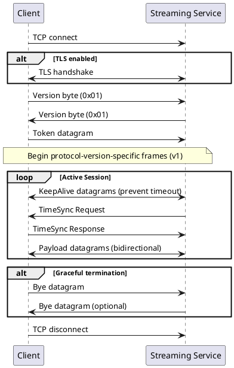

# Protocol Fundamentals

The TCP Streaming Protocol serves as the foundation for ultra-low latency, high-volume data exchange within the Subject Interface ecosystem. This section covers the core protocol specifications including version management, data encoding, and security options.

## Protocol Overview

The TCP Streaming Protocol provides continuous asynchronous bidirectional stream of datagrams between connected parties. Unlike traditional request-response patterns, this protocol maintains persistent connections optimized for real-time data exchange scenarios common in transportation systems.

### Protocol Flow Overview



### Core Protocol Characteristics

| Characteristic | Description |
|----------------|-------------|
| **Persistent Connections** | Long-lived TCP connections; eliminates overhead; supports continuous operation; automatic keep-alive |
| **Asynchronous Communication** | Independent bidirectional flow; no request-response coupling; parallel processing; queue-based transmission |
| **Message-Agnostic Design** | Handles any payload type; no inspection/validation; supports binary/text/structured data; single byte type identifier |
| **Frame-Based Structure** | Structured frames with integrity checking; fixed header; variable payload; boundary detection |
| **Built-in Monitoring** | Connection health monitoring; time sync verification; performance metrics; automatic violation detection |

## Protocol Version Management

### Current Protocol Version

| Aspect | Details |
|--------|----------|
| **Version** | `0x01` (single-byte identifier) |
| **Exchange** | During connection establishment |
| **Support** | Only supported version currently |


### Version Compatibility

| Aspect | Details |
|--------|----------|
| **Current Support** | Version `0x01` only |
| **Future Versions** | Incremental numbering; backward compatibility evaluation |
| **Negotiation** | May be enhanced in future protocols |

## Byte Order and Data Encoding

### Byte Order

| Aspect | Details |
|--------|----------|
| **Order** | Big-endian (network byte order) throughout |
| **Application** | All multi-byte fields; MSB transmitted first |
| **Standards** | Consistent with network protocols; no byte order marks |

### Encoding Standards

| Data Type | Encoding | Details |
|-----------|----------|----------|
| **Text Data** | ASCII | Tokens, identifiers, disconnect reasons; no null termination; length by frame size |
| **Timestamps** | UTC milliseconds since epoch | 8 bytes (64-bit); big-endian integer |
| **Numeric Fields** | Big-endian | Unsigned integers; size as specified; no padding |
| **Binary Payloads** | Pass-through | No encoding; application-specific |

### Frame Structure

```
+------------------+------------------+----------------------+
| Fixed Prefix     | Data Size        | Datagram Content     |
| 0xAA 0xBB        | 2 bytes          | Variable Size        |
| (2 bytes)        | (big-endian)     | (0-65535 bytes)      |
+------------------+------------------+----------------------+
```

| Component | Details |
|-----------|----------|
| **Fixed Prefix** | `0xAA 0xBB` - frame synchronization; start of every frame; loss of frame sync terminates connection |
| **Data Size** | 2 bytes big-endian; 0-65535 range; datagram content size only (excludes Fixed Prefix and Data Size fields) |
| **Datagram Content** | Variable size; datagram type byte + data; length must match size field |

## Transport Layer Security

### Security Mode Options

The protocol supports two security modes:

| Mode | Description | Performance | Use Cases |
|------|-------------|-------------|------------|
| **NONE** | Plain TCP without encryption | Optimal, no overhead | Isolated networks, development, non-sensitive data, legacy systems |
| **TLSv1.2** | Encrypted using TLS 1.2 | Additional latency and CPU usage | Production, public networks, sensitive data, compliance |

### TLS Configuration

| Component | Details |
|-----------|----------|
| **TLS Version** | TLS v1.2 exclusively; SSL/TLS v1.0/v1.1 prohibited; TLS v1.3 not supported |
| **Cipher Suite** | `TLS_ECDHE_RSA_WITH_AES_128_GCM_SHA256` only; ECDHE key exchange; AES-128-GCM; SHA-256 |
| **Authentication** | Standard TLS handshake; no client certificates; session auth via tokens |

## Connection Establishment

All communication patterns follow a consistent connection establishment sequence regardless of session type or protocol variant.

### Connection Establishment Sequence

| Step | Process |
|------|----------|
| **1. API Session Creation** | Create session via JSON-REST API; specify type/protocol; receive connection details and token |
| **2. TCP Connection** | Establish TCP to assigned Streaming Node; use host:port from session details |
| **3. Protocol Version Exchange** | Client sends version `0x01`; service validates and responds; connection closed if mismatch |
| **4. Token Authentication** | Client sends Token datagram; contains session token; service validates against active sessions |
| **5. Operational State** | Enter active streaming; enable bidirectional exchange; begin time sync monitoring |

### Connection Requirements

| Category | Requirements |
|----------|-------------|
| **Prerequisites** | Valid session via JSON-REST API; network connectivity; synchronized clock; valid token |
| **Protocol Support** | Version `0x01`; mandatory datagram types; time sync response; frame parsing/generation |
| **Security** | TLS support if enabled; encryption capability; cipher suite support; token security |

